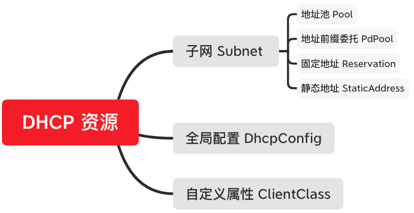

# DHCP
## 概要
为dhcp服务器提供配置接口，包含子网（Subnet）、全局配置（DhcpConfig）、自定义属性（ClientClass）， 子网包含地址池（Pool）、地址前缀委托（PdPool）、固定地址（Reservation）、静态地址（StaticAddress），除了静态地址和全局配置，其他配置信息经过有效性检查后保存到数据库， 并通过kafka下发给dhcp服务器

## 动机和目标
* 支持DHCPv4和DHCPv6子网、地址池、Option配置
* 支持全局配置、自定义属性配置

## 资源关系

## 详细设计
#### 全局配置 DhcpConfig
* dhcp模块的顶级资源，主要配置租赁的最大／小时间、默认时间，域名服务器
* 租赁时间，如果用户不配置，使用默认值，类型为整形，单位为秒
  * 最小租赁时间：默认值为3个小时，即10800
  * 最大租赁时间：默认值为4个小时，即14400
  * 默认租赁时间：默认值为4个小时，即14400
* 全局唯一，即数据库中只保存一份，list时会检查数据库中是否存在，不存在则使用默认值插入一个，如果存在，则直接返回
* 支持改、查，不支持增、删  
* 参数检查
  * 域名服务器的每个地址必须为有效的ip地址
  * 默认和最小／大租赁时间必须大于0，最小租赁时间不能大于最大租赁时间

#### 自定义属性 ClientClass
* dhcp模块的顶级资源，属性包含名字和正则表达式，名字不支持修改
* 如果想使用某个自定义属性作为子网选择的条件，在子网配置中输入该自定义属性的名字
* 支持增、删、改、查

#### 子网 Subnet
* dhcp模块的顶级资源，支持v4和v6，ipam规划的子网才能被dhcp模块用来创建和下发配置，在创建时还需要将ipam模块中所规划的子网的标识信息作为入参，此标识信息将在地址管理中展示
* 属性包含子网、默认租赁时间、最小／大租赁时间、域名服务器、网关（v4）、自定义属性、中继路由地址、网络标识、子网地址池容量（v4）、子网地址使用率（v4）
* 支持增、删、改、查
* 参数检查
  * 子网必须为有效CIDR，ipv6的子网掩码必须大于64
  * 域名服务器／网关（v4）/中继路由地址的所有地址，必须为有效的ip地址
  * 自定义属性必须是已创建的，不存在则报错
  * 子网地址池容量只计算ipv4类型的子网，暂不计算ipv6地址池容量
  * 子网的租赁最小时间必须小于最大时间
* 可更新字段：最大／小和默认租赁时间，域名服务器，网关（v4），自定义属性、中继路由地址
* v4子网使用率需要从dhcp服务器拿到子网的租赁信息计算
* 删除子网，数据库会同时删除子网的子资源信息，如地址池、前缀委托和固定地址

#### 地址池 Pool
* 父资源为Subnet，支持v4和v6，属性包含开始地址、结束地址、域名服务器、网关（v4）、自定义属性、地址池容量(v4)、地址池使用率(v4)
* 支持增、删、改、查
* 参数检查
  * 开始地址、结束地址必须为有效ip地址，地址版本一致，结束地址要大于开始地址，同时两个地址必须在子网的范围内
  * 域名服务器和网关（v4）的所有地址必须为有效ip地址
  * 自定义属性的值必须为已存在的自定义属性名字
  * 新建的地址池不能与已存在的地址池、地址前缀委托、静态地址有交集
* 新建或者删除v4子网的地址池，会使用地址池的地址容量更新子网的地址容量
* v4的地址池使用率会根据dhcp服务器的租赁信息计算
* 可更新字段：域名服务器、网关（v4）、自定义属性

#### 前缀委托 PdPool
* 父资源为Subnet，只支持v6，属性包含前缀、前缀长度、委托长度、域名服务器、自定义属性
* 支持增、删、改、查
* 参数检查
  * 前缀必须为有效的ipv6地址，且必须在子网的范围内
  * 前缀长度必须大于64，委托长度必须大于等于前缀长度，且两者都要小于128
  * 域名服务器中所有地址必须为有效的ip地址
  * 自定义属性的值必须为已存在的自定义属性的名字
  * 前缀委托不能和已存在的地址池、前缀委托、固定地址、静态地址有交集
* 可更新字段：域名服务器，自定义属性

#### 固定地址 Reservation
* 父资源为Subnet，支持v4和v6，属性包含mac地址和ip、域名服务器、自定义属性、网关（v4）、地址池容量（v4）、地址池使用率（v4）
* 支持增、删、改、查
* 参数检查
  * mac地址必须为有效的mac地址，且在数据库中唯一
  * ip地址必须有效且在子网的范围内，且不能在已存在的前缀委托、静态地址有交集
  * 域名服务器和网关（v4）的每个地址都必须为有效的ip地址
  * ipv4的地址绑定，如果ip地址在已存在的地址池中，则不增加子网的地址池容量，否则子网的地址池容量加一
* 可更新字段：域名服务器、网关（v4）
* 删除v4的固定地址，如果固定地址影响了子网地址池容量，则子网的地址池容量减一

#### 静态地址 StaticAddress
* 父资源为Subnet，支持v4和v6，属性包含mac地址 HwAddress、ip地址 IpAddress、地址容量 Capacity、版本 Version
* 支持增、删、查
* 静态地址和其它所有地址类型互斥
* 配置不会下发
* 增加或者删除会影响子网地址池容量

## 未来工作
* v6子网和地址池的容量以及使用率的表示
* 支持更多的全局配置和自定义属性