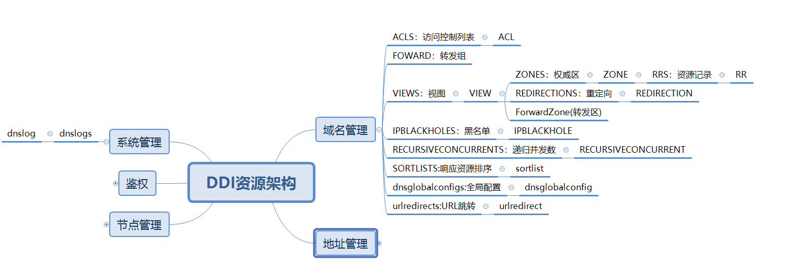

# DNS
## 概要
为dns服务器提供配置接口，包含访问控制列表（acl）、视图（view）、权威区（zone）、转发区（forwardzone）、 资源记录（rr）、dns64、转发组（forward）、
ip黑名单（ipblackhole）、重定向（redirection）、递归并发数（recursiveconcurrent）、dns访问日志开关（log），配置信息经过有效性检查后保存到数据库， 并通过kafka下发给dns服务器

## 动机和目标
* 支持DNS域名v4和v6的IP解析,支持信息按视图路线查询返回.

## 资源关系

## 详细设计
#### 访问控制列表 ACL
* dns模块的顶级资源，主要用于设置ip集合范围,该ip集合可用限制某些功能的使用范围.
* acl的内容为ip或者ip网段的集合,或者可以是单独的运营商.运营商有三个,cmcc,cucc,ctcc.分别表示中国移动,中国联通,中国电信.
* acl全局可用，即定义后在所有地方都可用使用.
* 存在默认的any和none两个acl,不可修改和删除.
* acl属性ip支持非操作.
* 支持增删改查.  
* acl的id和名字一致.

#### 视图 View
* dns模块的顶级资源，名字不支持修改,通过和acl集合绑定,表示某个范围内的用户群体,属性有优先级,DNS64前缀,acl列表.
* 视图有一个不能删除的默认视图default.视图有优先级,1级为最高优先级,用户定义的优先级可用调整.default总是为最低优先级.
* 视图的名字和ID一致.
* 支持增、删、改、查

#### 权威区 Zone
* Zone属于View模块下的资源，用于管理某个域名解析的配置集合
* 权威区下分为正向解析域名和反向解析域名
* 支持增、删、改、查

#### 转发区ForwardZone
* ForwardZone属于View模块下的资源，用于设置可以转发的DNS域名.可以设置两种转发方式only和first.
* 转发区跟转发组关联.一个转发区可以对应多个转发组,一个转发组也可以对应多个转发区.
* 支持增、删、改、查

#### 资源记录 Rr
* 父资源为Zone，支持v4和v6，资源类型包含A|AAAA|CNAME|HINFO|MX|NS|NAPTR|PTR|SRV|TXT|URL.
* 支持增、删、改、查
* 者删除区的时候,会将下面所有的资源自动删除

#### 转发组 Forward
* 为DNS的顶级资源，支持v4,v6，属性为ip集合.
* 支持增、删、改、查
* 和区相关联,属于多对多的关系.

#### 重定向 Redirection
* 父资源为View，支持v4，属性包含区名称,ttl,数据类型,数据值,重定向方式.
* 支持增、删、改、查
* 重定向的域名没有通配功能.

#### IP黑名单 IPBlackHole
* DNS的顶级资源，属性包含acl,用于定义DNS访问允许访问的客户地址集合.
* 支持增、删、改、查

#### 递归安全 RecursiveCurrent
* DNS的顶级资源，属性为总的递归并发数和单个递归并发数,用于定义DNS递归访问时最大的并发连接数.
* 支持修改、查询.

#### DNS全局配置 dnsglobalconfigs
* DNS的顶级资源，属性包括isLogOpen和ttl,分别表示用于是否dns服务的日志和设置全局DNS的ttl时间.
* 接口只支持修改、查询.
* update接口参数设置为{}时,系统会使用默认值进行更新.isLogOpen默认值为true,ttl默认值为3600.

#### DNS URL跳转 urlredirects
* DNS的views下的资源，通过设置一个已知的域名,和一个需要跳转的url,当客户访问域名的时候,能够自动跳转访问url的内容.
urlredirect资源包含了一个域名和一个url项.两者都是必填项.一个域名只允许设置一个url跳转.暂时不考虑不同视图有相同的域名做跳转的场景.
* 接口支持增删改查.

#### DNS 权威批量主备切换 urlredirects
* DNS的views下区的权威记录,支持主备两种数据切换使用,一个区下的主备数据切换的时候,该区下的所有资源记录的主备都会同时切换,
如果备份数据不存在的情况下切换为备份数据,会使用主的数据替代.
*在具有相同的名称,类型的情况下,备份数据不允许和所有其他记录冲突.
*切换后的记录,通过DNS请求查询,可以得到对应的解析结果.

#### 解析日志 dnslogs
* log模块下的顶级资源，可以通过日期过滤查询结果,也可以使用ip作为过滤结果.在相同过滤条件下,导出的内容和查询结果内容一致.
* 接口只支持查询和导出功能.

## 未来工作
* 批量的区定义导入.
* 支持更多的全局配置和自定义属性
