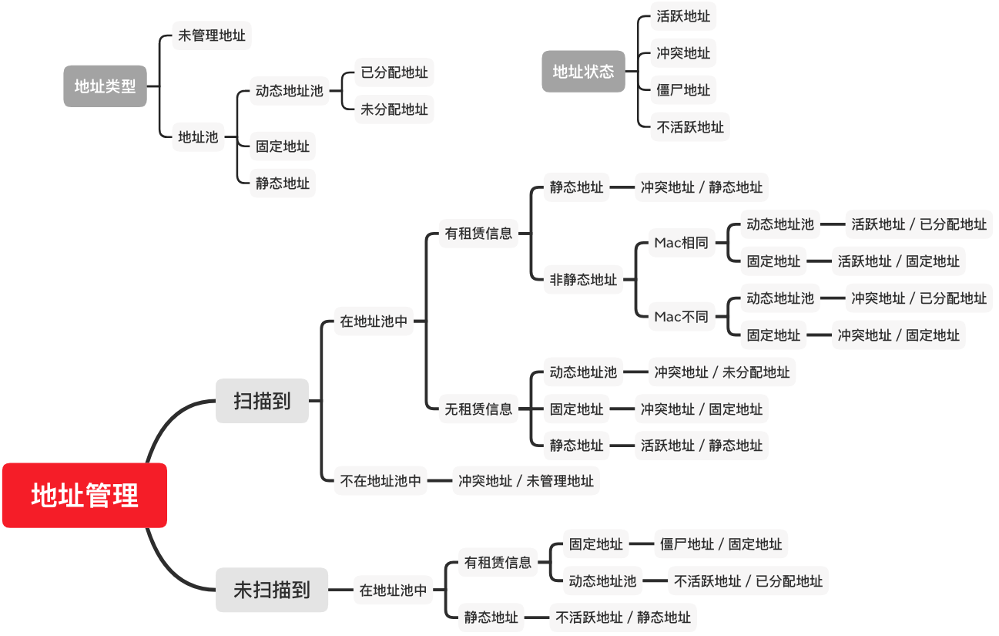

# 地址管理
## 概要
通过设备探测模块添加资源Router，通过SNMP协议，扫描每个Router所有的Subnet的IP与MAC的对应关系，然后通过DHCP配置和DHCP租赁信息整合，提供每个子网的地址信息和状态

## 地址类型和地址状态
* 地址类型
  * 动态地址池
    * 已分配地址：动态地址池中，已经分配出去且未到期的的地址
    * 未分配地址：动态地址池中，没有租赁信息或者已经过期的地址
  * 固定地址：由dhcp server分配的，与MAC绑定的地址
  * 静态地址：由管理员手动配置，与MAC绑定的地址
  * 未管理地址：没有在地址池中的地址
* 地址状态
  * 活跃地址：
    * 可以扫描到，在DHCP中有租赁信息，且扫描的IP对应的MAC，与租赁信息的MAC一致
    * 可以扫描到，在DHCP中没有租赁信息，且地址类型为静态地址
  * 冲突地址：
    * 可以扫描到，在DHCP中有租赁信息，但是地址类型为静态地址
    * 可以扫描到，在DHCP中有租赁信息，且扫描的IP对应的MAC，与租赁信息的MAC不一致
    * 可以扫描到，但DHCP中没有租赁信息，且不是静态地址
    * 可以扫描到，但是不在地址池中的地址
  * 僵尸地址：扫描不到，但是DHCP中有租赁信息，且属于固定地址的地址
  * 不活跃地址：
    * 扫描不到，但是DHCP中有租赁信息，且属于动态地址池的地址
    * 扫描不到，地址类型为静态地址
* 地址类型与地址状态逻辑导图如下：

## 详情设计
### 设备管理 NetworkEquipment 
* ipam模块的顶级资源，字段包含设备名字 Name、管理地址 AdministrationAddress、设备类型 EquipmentType、厂商 Manufacturer、序列号 SerialNumber、固件版本FirmwareVersion、上联地址UplinkAddresses、下联地址DownlinkAddresses、下一跳地址NextHopAddresses、机房ComputerRoom、机柜ComputerRack、位置Location、所属部门Department、负责人ResponsiblePerson、联系电话Telephone、SNMP端口 SnmpPort、SNMP团体名 SnmpCommunity、上次扫描时间LastRefreshTime、管理MAC AdministrationMac
* 设备类型支持：路由器 router、安全网关 security_gateway、核心交换机 core_switch、接入交换机 access_switch、汇聚交换机 convergence_switch、防火墙 firewall、无线AP wirelessAp、无线AC wirelessAc、其它 other
* 支持增、删、改、查
* 支持修改的参数为管理地址 AdministrationAddress、设备类型 EquipmentType、厂商 Manufacturer、序列号 SerialNumber、固件版本FirmwareVersion、机房ComputerRoom、机柜ComputerRack、位置Location、所属部门Department、负责人ResponsiblePerson、联系电话Telephone、SNMP端口 SnmpPort、SNMP团体名 SnmpCommunity、管理MAC AdministrationMac
* 上联地址和下联地址针对交换机，下一跳地址针对路由设备

### 终端管理 Asset
* ipam模块的顶级资源，字段包含Mac地址 Mac、ipv4地址 Ipv4s、ipv6地址 Ipv6s、终端名字Name、终端类型 DeviceType、部署服务 DeployedService、机房ComputerRoom、机柜ComputerRack、上联网络设备 SwitchName、上联设备端口 SwitchPort、所属部门Department、负责人ResponsiblePerson、联系电话Telephone、Mac地址所在Vlan的ID VlanId
* 终端类型支持：主机 pc、移动设备 mobile、打印机 printer、摄像机camera、网络视频录像机nvr、物连设备iot、其它 other
* 支持增、删、改、查
* 支持register action
  * 参数为ip 地址、Mac地址所在Vlan的ID VlanId、地址所在的subnetId、机房ComputerRoom、机柜ComputerRack、上联网络设备 SwitchName、上联设备端口 SwitchPort
  * 限制一个mac地址，在一个子网中只有一个ip
  * ip如果是v4地址，会更新到ipv4s, 如果是v6地址，会更新到ipv6s，更新的逻辑就是如果找到subnetId对应的ip就替换，如果没有找到，就添加到列表中

### 扫描子网 ScannedSubnet
* ipam模块的顶级资源，字段包含网段 Ipnet、标志 Tags、已分配比率 AssignedRatio、未分配比率 UnassignedRatio、固定地址比率 ReservationRatio、静态地址比率 StaticAddressRatio、未管理地址比率 UnmanagedRatio、活跃地址比率 ActiveRatio、不活跃地址比率 InactiveRatio、冲突地址比率 ConflictRatio、僵尸地址比率 ZombieRatio
* 其中地址类型比率：AssignedRatio、UnassignedRatio、ReservationRatio、StaticAddressRatio，他们的分母是四个总和，UnmanagedRatio 分子为地址池外的所有地址，分母为子网所有地址
* 地址状态比率：ActiveRatio、InactiveRatio、ConflictRatio、ZombieRatio，他们的分母是四种状态地址的总和
* 支持获取
* 支持动作：action=exportcsv，导出文件的表头为：IP地址, MAC地址, 地址类型, 地址状态, 租赁时间, 租赁过期时间，文件名字格式：subnet-{subnetId}-timestamp.csv
  * Output：
    * path: 类型为string，表示文件存储的绝对路径
* 扫描间隔为60秒

### 网络接口 NetworkInterface
* 父资源为ScannedSubnet，字段包含接口地址 Ip、接口硬件地址 Mac、主机名 Hostname、租赁时间 ValidLifetime、过期时间 Expire、地址类型 IpType、地址状态 IpState、Mac地址所在Vlan的ID VlanId
* 地址类型：已分配地址、未分配地址、固定地址、静态地址、未管理地址
* 地址状态：活跃地址、不活跃地址、冲突地址、僵尸地址
* 只支持获取
  * filter
    * 支持ipstate、mac、ip，filter的modifier只支持eq，即：ipstate_eq=active或者ipstate=active
    * ipstate支持的有效值为active、inactive、conflict、zombie, 如果传的值不是有效值，返回空
* 地址类型转换
  * 可以转成静态地址：地址类型为未管理地址、地址状态为冲突地址
  * 可以转成固定地址：
    * 地址类型为未管理地址、地址状态为冲突地址
    * 地址类型为未分配地址、地址状态为冲突地址
    * 地址类型为已分配地址、地址状态为活跃地址
  * 不活跃的静态地址可以回收（删除）
